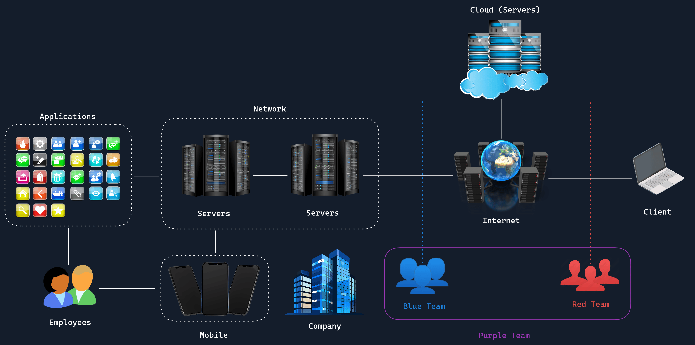

# Structure of InfoSec
https://academy.hackthebox.com/module/293/section/3315

---

Information Security, is called **InfoSec** it is about safeguarding information and systems from people who must not have acces to them. 
    
    (Not viewing, changing or destroying unauthorized data)

---

### Approximate structure of the digital world

- **Client**: This is a PC/Laptop through which you access resources and services "on the Internet".

- **Internet**: This is a vast, interconnected network of servers that offer different services and applications, such as Hack The Box.

- **Servers**: Servers provide various services and applications designed to perform specific tasks. For example, one type of server might be a "web server", allowing you and others to view the content of a website (such as this section you're reading currently) on your computer or smartphone.

- **Network**: When multiple servers or computers are connected and can communicate with each other, it's called a network.

- **Cloud**: Cloud refers to data centers that offer interconnected servers for companies and individuals to use.

- **Blue Team**: This team is responsible for the internal security of the company and defends against cyber attacks.

- **Red Team**: This team simulates an actual adversary/attack on the company.

- **Purple Team**: This team consists of both Blue Team and Red Team members working together to enhance the company's security.

---

You information is like a treasure stored in a castle. The walls, drawbridges and guards are the security measures protecting your treasure from thieves.

- **The Treasure**: Your valuable data and information.
- **The Castle Walls**: Firewalls, defensive mechanisms, and encryption that keep outsiders from getting in.
- **The Guards**: Security protocols and access controls that monitor who enters and leaves.
- **Penetration Testers**: Knights who test the castle's defenses by simulating attacks to find weak spots.
- **Digital Transformation**: Expanding the castle to store more treasure, which attracts more thieves.
- **Cyber Threats**: Thieves who are constantly looking for ways to breach the castle's defenses.

InfoSec is necessary, a breach can lead to enormous consequences. Including, financial loss, reputational damage, legal ramifications and national security threats.

---

InfoSec objectif is to ensure the **confidentiality**, **integrity and availability** of the data.

The range of assets consist (but is not limited to):

1. Network Security
2. Application Security
3. Operational Security
4. Disaster Recovery and Business Continuity
5. Cloud Security
6. Physical Security
7. Mobile Security
8. Internet of Things (IoT) Security

---

**risk** : potential for a malicious event to occur, which could cause damage to an organization's assets. (such as data or infrastructure)

Managing risk involve identifying and applying appropriate measure to mitigate threats and minimize vulerabilities.

**threat** : is a potential cause of an incident that could result in harm to a system or organization.(it can be a person or natural event like fire).

Threats exploit the vulnerabilites to compromise a system.

**vulnerabity** : is a weakness in a system that could be exploited by a threat. (softwar bugs, misconfiguration, weak password ect).

A vulnerability doesnt mean the system will me compromised. There must me a threat to exploit that vulnerability.

    In essence, a risk represents the potential for damage, a threat is what can cause that damage, and a vulnerability is the weakness that allows the threat to cause damage.

---